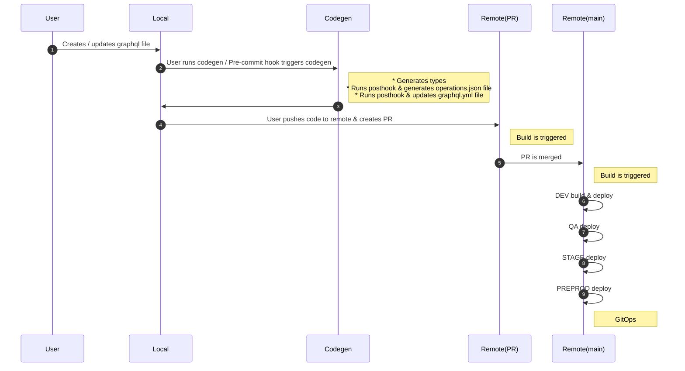

# GraphQL Query Registration & Persisted Queries

## Why Persist Queries

A Graphql operation can be executed using an operation's ID instead of the entire operation string.
 - An operation's ID is a hash of the full query string.
 - Hashes can be generated using various hashing techniques. We use `SHA-256` which produces `consistent hashes`.

> PROs
 - Using operation ID enables us to use HTTP `GET` instead of the default `POST`, making them easier to cache.
 - It adds additional security to queries since server only responds if the operation ID matches the registered IDs in server.

> CONs
 - Generating hash is automated using codegen, but adds into the build time.
 - Everytime a hash is generated/updated `mGQL` needs to be updated via GitOps which adds into the build time.
 - Passing hash as query makes network query inspection more difficult.

#### How PQ generation works

#### How PQ is registered
> TODO

#### How client handles PQ calls
> TODO
